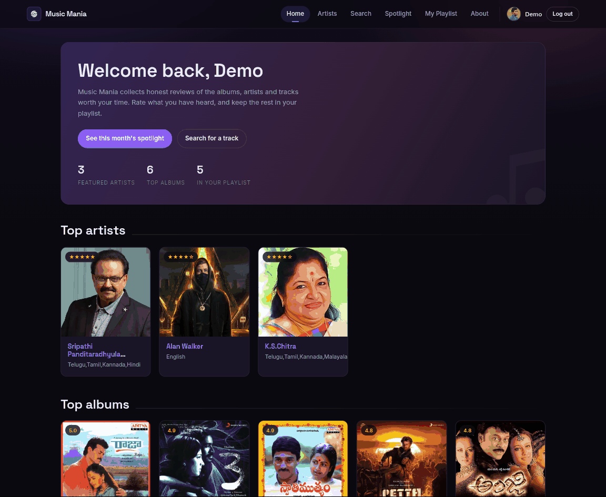
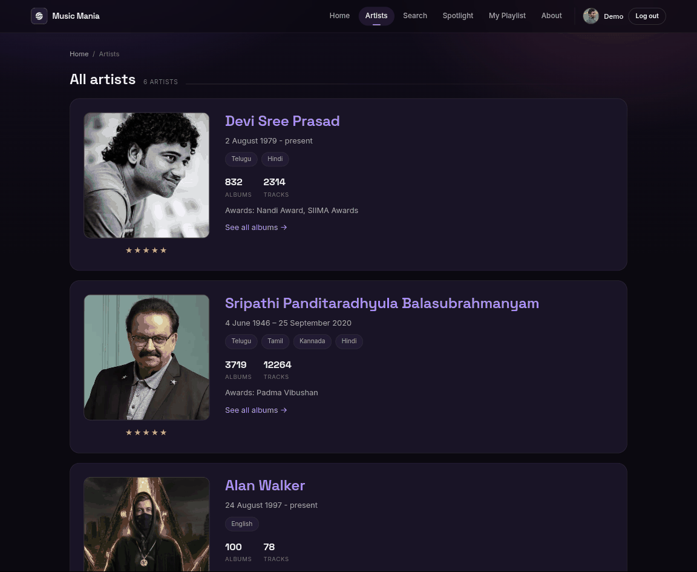
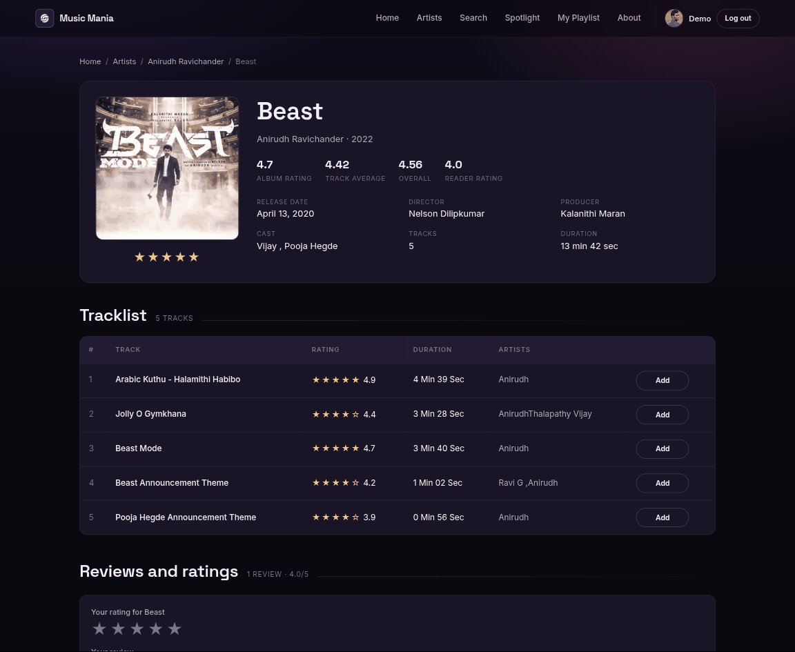
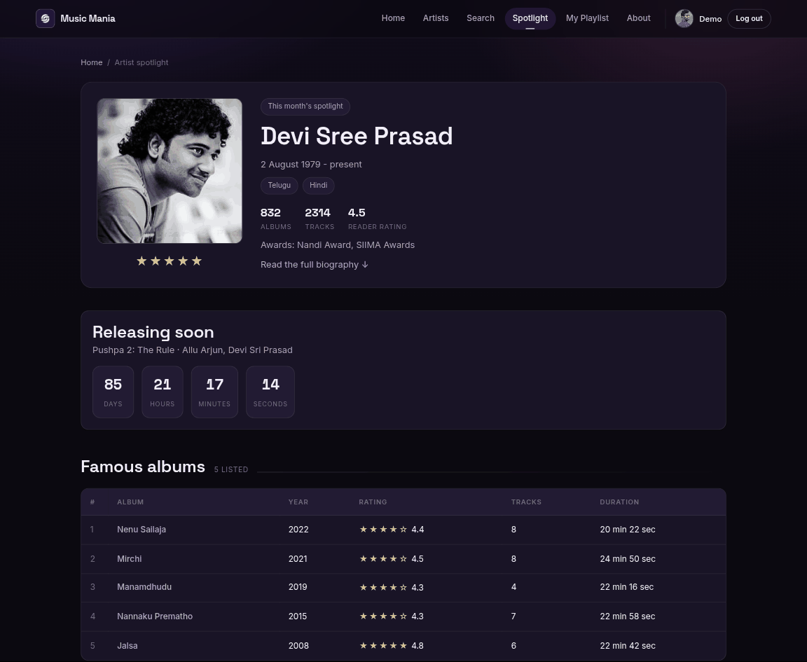
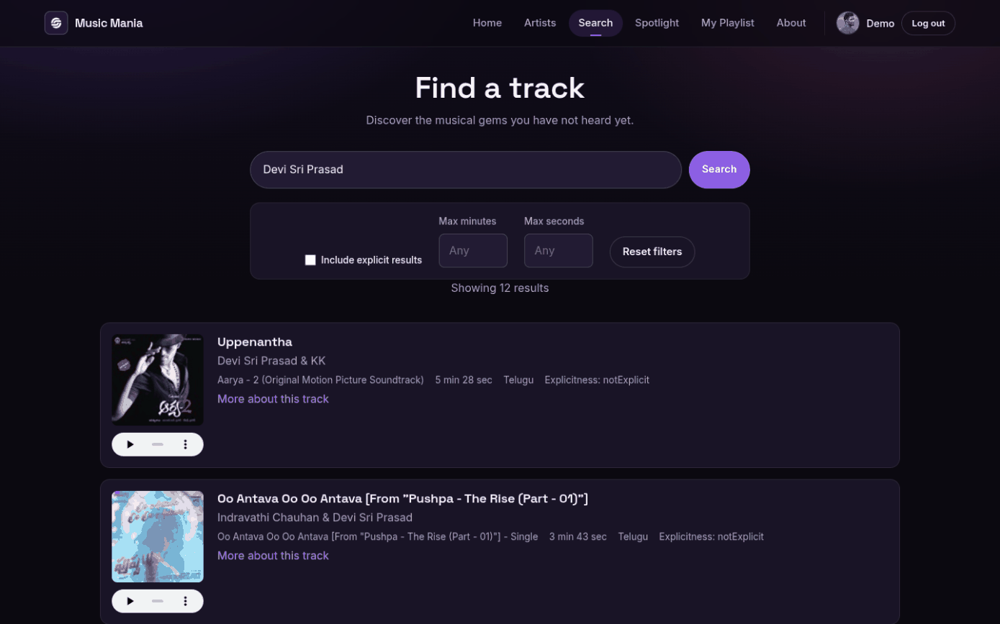
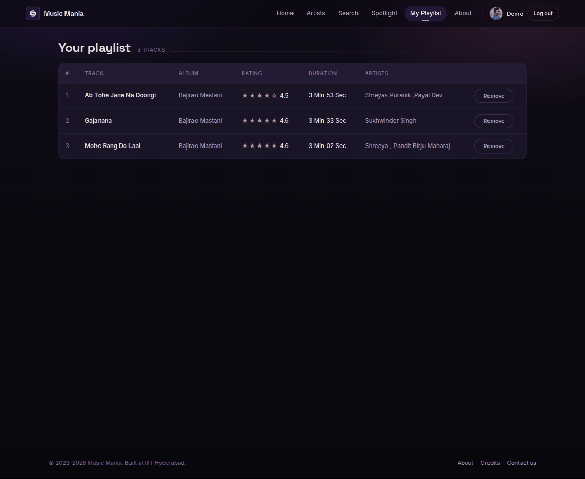
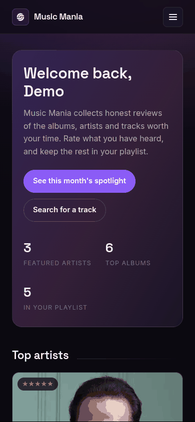
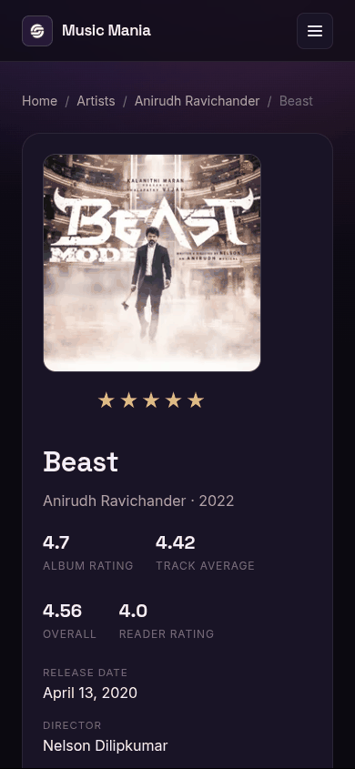
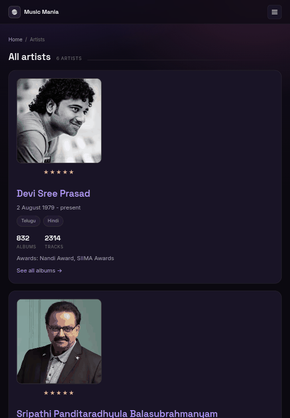

<div align="center">

<picture>
  <source media="(prefers-color-scheme: dark)" srcset="./docs/assets/adk_dev_logo_light.png">
  
</picture>

# Music Mania

**A music review site: browse artists and albums, rate and review them, keep a playlist, and search the iTunes catalogue for anything not covered here.**


<br>


<br><br>

**[Developer documentation](./DEVDOC.md)** &middot; [Screenshots](#screenshots) &middot; [Features](#features) &middot; [Getting started](#getting-started)

</div>

---

## Contents

- [Why this project matters](#why-this-project-matters)
- [Screenshots](#screenshots)
- [Responsive layout](#responsive-layout)
- [Features](#features)
- [Roles](#roles)
- [The review lifecycle](#the-review-lifecycle)
- [Tech stack](#tech-stack)
- [Getting started](#getting-started)
- [Contributors](#contributors)
- [Contributing](#contributing)
- [License](#license)

---

## Why this project matters

A review site is a small idea with an awkward middle: the catalogue is finite and
the thing someone wants to look up usually is not in it. Most projects solve that
by pretending the gap does not exist.

Music Mania keeps its own catalogue for the artists and albums it has real
editorial content for - biographies, awards, the release crew, three separate
ratings per album - and hands anything else to the iTunes search, where a track
can be found and previewed for thirty seconds without leaving the page. The
curated part stays curated and the long tail is still reachable.

The other decision worth naming is that **an album carries three ratings**: its
own, the average of its tracks, and the blend of the two. One number would hide
the case that actually matters, which is a well-regarded album carried by two
songs.

It started as a static HTML project and is now a Flask application backed by
SQLite. For architecture, data model, and setup, see
**[DEVDOC.md](./DEVDOC.md)**.

## Screenshots

Real 1440x1180 viewport renders against the demo account that
`flask --app run init-db` creates. The app ships a **single dark theme**, so
unlike the other projects in this account there is no light gallery and no
`README-light.md` to toggle to.

<table>
  <tr>
    <td width="33%" valign="top">
      
      <p align="center"><b>Home</b><br><sub>Highest rated artists and albums, and what is in your playlist.</sub></p>
    </td>
    <td width="33%" valign="top">
      
      <p align="center"><b>Artists</b><br><sub>Languages, awards, and how much of their work is here.</sub></p>
    </td>
    <td width="33%" valign="top">
      
      <p align="center"><b>An album</b><br><sub>Three ratings, the crew, the tracklist, and Add on every track.</sub></p>
    </td>
  </tr>
  <tr>
    <td width="33%" valign="top">
      
      <p align="center"><b>Spotlight</b><br><sub>One artist a month, with a live countdown to the next release.</sub></p>
    </td>
    <td width="33%" valign="top">
      
      <p align="center"><b>Search</b><br><sub>The iTunes catalogue, filtered, with a 30 second preview per track.</sub></p>
    </td>
    <td width="33%" valign="top">
      
      <p align="center"><b>Playlist</b><br><sub>What you saved, with the album it came from.</sub></p>
    </td>
  </tr>
</table>

## Responsive layout

Each of these is a single render at that exact viewport, not a scaled-down
desktop shot.

<table>
  <tr>
    <td width="28%" valign="top">
      
      <p align="center"><b>Phone, 390x844</b><br><sub>The nav collapses; the stat row wraps rather than shrinking.</sub></p>
    </td>
    <td width="28%" valign="top">
      
      <p align="center"><b>Phone, an album</b><br><sub>Cover, ratings and crew stack in one column.</sub></p>
    </td>
    <td width="44%" valign="top">
      
      <p align="center"><b>Tablet, 820x1180</b><br><sub>Artist cards go full width with the portrait above the detail.</sub></p>
    </td>
  </tr>
</table>

## Features

### Browsing
- Home page with the highest rated artists, albums and songs, plus a count of what is in your playlist
- Artist list with rating, active languages, album and track counts, and awards
- Artist pages with a full biography, their albums, and a link to related artists
- Album pages with the tracklist, the release crew (director, producer, cast), and three ratings: the album's own, the average of its tracks, and the blend of the two
- A monthly Artist Spotlight page with a live countdown to the next release
- Breadcrumbs on every catalogue page so you can climb back up a level

### Reviews
- Rate any artist or album from one to five stars and write a review
- Reviews are attached to the artist or album they were written about, so an album page only shows reviews of that album
- Each page shows the review count and the average reader rating alongside the editorial rating

### Playlist
- Add or remove any track from the home page, an album page, or the playlist itself
- The button reflects the current state, so you can see at a glance what you have already saved
- Removing a track from the playlist page drops it out of the table without a reload

### Search
- Search the iTunes catalogue by artist, album or track
- Play a 30 second preview inline
- Filter by maximum duration and choose whether to include explicit results

## Roles

There is one kind of user. Everything except the login and signup pages requires an account.

| Role | Can do |
|---|---|
| **Signed-in user** | Browse the catalogue, rate and review artists and albums, manage their own playlist, search iTunes |
| **Anonymous visitor** | Log in or sign up. Any other URL redirects to the login page and returns you there afterwards |

## The review lifecycle

1. You open an artist or album page and pick a star rating.
2. You write the review text. Both are required: a rating with no words, or words with no rating, is rejected with a message rather than saved.
3. The review is stored against that artist or album with today's date and your user id.
4. It appears immediately in the reviews list on that page, newest first, and is counted into the reader rating shown at the top.

Reviews cannot currently be edited or deleted from the interface.

## Tech stack

Flask and Jinja templates on the server, SQLite for storage, and plain CSS and JavaScript on the front end. No build step and no front-end framework.

## Getting started

See [DEVDOC.md](./DEVDOC.md#local-development) for setup. The short version:

```bash
python3 -m venv .venv
.venv/bin/pip install -r requirements.txt
.venv/bin/flask --app run init-db     # builds the database and adds demo accounts
.venv/bin/python run.py
```

Then open http://127.0.0.1:5000 and log in as **`demo` / `demo1234`**.

The database is **not** in the repository. `init-db` creates it, loads the
catalogue from [`data/catalogue.json`](data/catalogue.json), and adds two demo
accounts whose passwords are hashed the same way the signup form hashes yours.

## Contributors

<table>
  <tr>
    <td align="center">
      <a href="https://github.com/Dileepadari">
        
        <br><sub><b>Dileep Adari</b></sub>
      </a>
      <br><sub>Author and maintainer</sub>
    </td>
  </tr>
</table>

Album art, artist photography and track metadata belong to their respective
rights holders and are used here for a non-commercial student project. Search
results and previews come from the public iTunes Search API.

## Contributing

Issues and pull requests are welcome at
[github.com/Dileepadari/MusicMania](https://github.com/Dileepadari/MusicMania).

Before opening a pull request:

```bash
python -m pytest -q                 # 40 tests, no setup beyond the dependencies
```

CI runs the suite on Python 3.11, 3.12 and 3.13, builds a database from a clean
checkout and serves it, audits the dependencies, and checks that **no database
file and no literal credential** has come back into the tree. Keep commit
messages to a single line, and match the surrounding code rather than
introducing a new style.

## License

MIT. See [LICENSE](./LICENSE).
